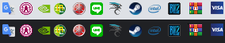
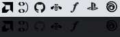
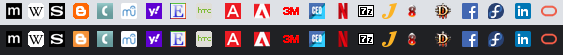
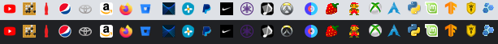
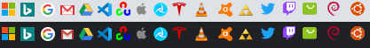

# [設�?] favicon?�樣

?�樣?�大?��?，基?��??�是建議??12x512?�畫?��??��?使用軟�?轉�???6x16  
不�?好�??��?差�?�?

?�?��??�太?��??��??��???6x16?��?清�?�??�人心中30??  

?�能?��?設�?不錯，�??�透�?導致被�?體�??��??��?(?�人心中40??  

純�?字�?�???��?好�?，�??��?機�??��?�??�人心中60??  

?��??��??�樣，是?��??��?設�?，�??��?嫌�??��?(?�人心中80??  

好�?設�?顏色不�??��???6x16下能輕�?得�??��?�???�度，�?好是??��層色?��?要�?�??�人心中100??  

?�以Partially Ordered Magic?�用[?�單?��?設�?](http://posetmage.com/SettingBook/Setting/Appendix/PosetMage/)

---
tags:
  - [[UI/UX]]
  - [[favicon]]

---
